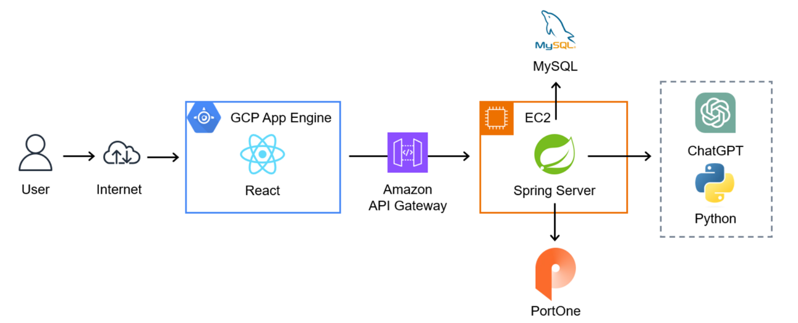
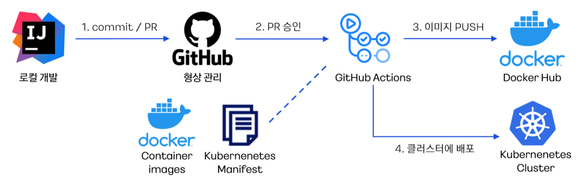

# 모두를 위한 지능형 Kiosk

## 프로젝트 개요
이 프로젝트는 키오스크 사용이 어려운 정보 약자들을 위해 사용자 친화적이고 접근성이 높은 화면 구성을 목표로 합니다. GPT-4와 음성 인식 기술을 키오스크에 접목하여 누구나 쉽게 사용할 수 있도록 설계되었습니다.

## 주요 기능
- **음성 인식 및 상호작용**: Google Cloud Speech API와 GPT-4를 활용하여 음성으로 메뉴를 탐색하고 주문할 수 있습니다.
- **결제 모듈**: 이니시스 결제 모듈을 연동하여 안전하고 편리한 결제 기능을 제공합니다.
- **관리자 페이지**: 상품 추가/삭제, 카테고리 관리, 주문 확인 및 환불 처리 등의 기능을 관리할 수 있습니다.
- **접근성 개선**: 고대비 모드와 같은 기능을 통해 저시력자 등 정보 접근에 어려움을 겪는 사용자의 편의를 돕습니다.

## 기술 스택
- **백엔드**: Spring Boot
- **프론트엔드**: React
- **데이터베이스**: MySQL, Redis
- **컨테이너**: Docker, Kubernetes
- **클라우드**: AWS, GCP, GCP App Engine
- **외부 API**: GPT-4o API, Google Cloud Speech API, Google Cloud Vision API
- **협업 툴**: GitHub, JIRA, Notion

## 팀 구성 및 역할

* 원영훈(2024.06.24 ~ 2024.09.05) : 팀장, 결제 / GPT 모듈 백엔드 연동, GPT 프롬프트 엔지니어링, 백엔드(상품 추가 및 삭제 컨트롤러 작성), GCP STT/TTS API를 이용해 음성인식 및 음성 출력 모듈 작성 / Cloud Bucket API를 이용한 사진 업로드 연동 / 기능 구현
* 배효진(2024.06.24 ~ 2024.09.05) : 팀원, 결제 / GPT 모듈 백엔드 연동, GPT 프롬프트 엔지니어링, 결제 정보 DB 저장 및 결제 취소 구현
* 이예승(2024.06.24 ~ 2024.09.05) : 팀원, 관리자 페이지, 카테고리 추가 / 삭제, 상품 검색 및 추가 백엔드 및 프론트엔드 페이지 구현, CI/CD, GPT API 및 프롬프트 엔지니어링
* 이윤동(2024.06.24 ~ 2024.09.05) : 팀원, 상품 검색 / 추가 관련 백엔드 기능 구현, 프론트엔드 책임, 프론트엔드 구체화 및 고도화, 로깅() 구현
* 윤성빈(2024.06.24 ~ 2024.09.05) : 팀원, 결제 페이지 및 GPT 모듈 프론트엔드 연동, 쿠폰 적립 및 결제 페이지 프론트엔드 작성
* 최성준(2024.06.24 ~ 2024.09.05) : 팀원, 로그인 / 로그아웃 관련 백엔드 및 프론트엔드 구현, CI/CD
* 이고은(2024.06.24 ~ 2024.07.22) : 팀원, 적립금 관련 컨트롤러 구현, GPT 프롬프트 엔지니어링 (2차 어플리케이션 고도화 스프린트 불참)

## 인프라 구조도


## CI/CD 구조도


## 설치 및 실행 방법
### 1. 클론 저장소
```bash
git clone https://github.com/your-repo/kiosk.git
cd kiosk
```

